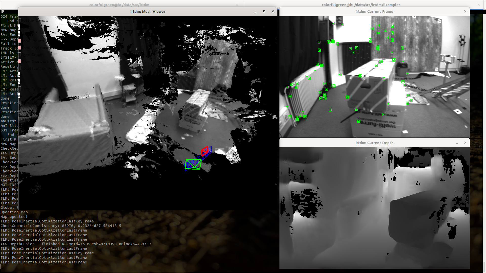

# RTDM 

A real-time tracking and dense mapping system based on [ORB-SLAM3](https://github.com/UZ-SLAMLab/ORB_SLAM3), [ASMVSNet](https://github.com/colorfulgreen/ASMVSNet) and [ReFusion](https://github.com/PRBonn/refusion).

